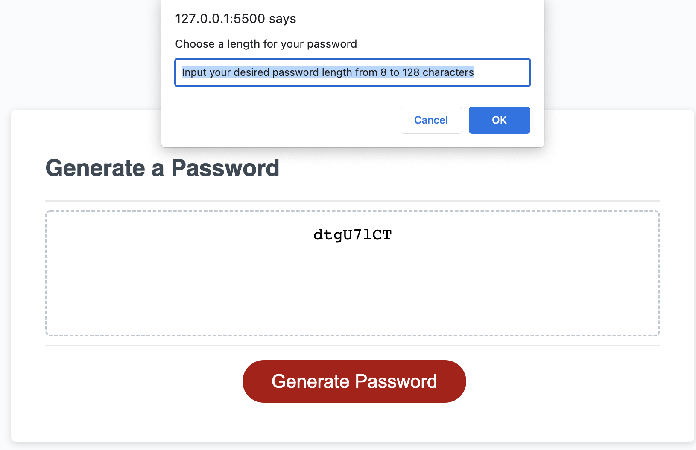

# Password-Generator

## Password Generator
This project utilized HTML, CSS, and Javascript to generate a password based on user criteria 
Once a user clicks the "Generate Password" button, they must select a password length (8–128 characters) and are then presented options for the types of characters to be included: lowercase letters, uppercase letters, numbers, and special characters. 
 
If an invalid length is selected, users are prompted to choose a valid password length 
 
If no character types are selected, the user is prompted to choose at least one character type. 
 
The deployed application can be found here: [link to deployed application](https://okapikid.github.io/Password-Generator/)

Here is a screenshot of the project: 
